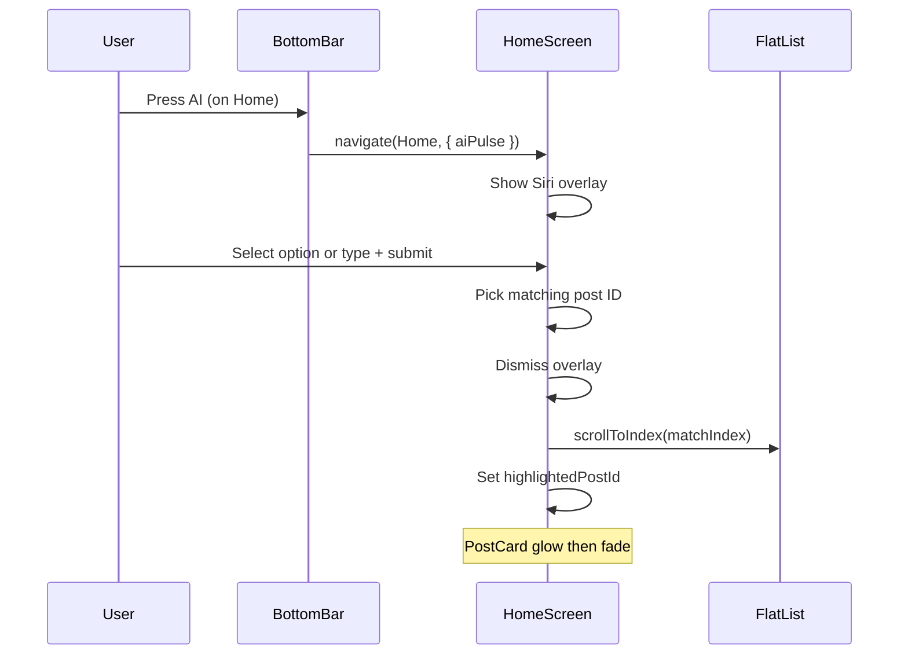

# Home Page AI Button: Siri-Style Flow and Post Highlight

## Current behavior

- **BottomControlBar** ([src/components/BottomControlBar.js](src/components/BottomControlBar.js)): The center AI button does **not** navigate away; it calls `navigation.navigate(current, { aiPulse: Date.now() })` so the **current** screen receives a new `aiPulse` param. Each screen can react differently.
- **AIPlanScreen** already uses `useRoute()` and `route.params?.aiPulse` to open/close its question flow and overlay.
- **HomeScreen** ([src/screens/HomeScreen.js](src/screens/HomeScreen.js)) does **not** read route params yet; it only renders the feed (categories + `FlatList` of `PostCard` with `MOCK_POSTS`).

So the “act differently per page” wiring is already there: only **HomeScreen** needs to implement its own AI flow when `aiPulse` is received.

---

## Target behavior (Home only)

1. **Trigger**: User is on Home and presses the center AI button.
2. **Siri-style overlay**:
  - Screen fades (backdrop dims; optional blur for glass effect).
  - Central content appears: title **“What are you looking for?”**, quick-select buttons (e.g. Food, Nearby, Open now, Hangout, Trending), and an “Or type something” input.
  - User either taps a chip or types and confirms.
3. **After submit**:
  - Overlay dismisses with a smooth exit animation.
  - Feed scrolls to a post that “matches” the choice (see matching logic below).
  - That post gets a **glowing border / highlight** with an Apple-style glass feel (soft scale + border glow that fades after a few seconds).

---

## Architecture (no change to nav)

- **BottomControlBar**: Keep as-is; it already passes `aiPulse` to the current route.
- **HomeScreen**: Add `useRoute()`, react to `route.params?.aiPulse`, and implement the overlay, matching, scroll, and highlight entirely inside [src/screens/HomeScreen.js](src/screens/HomeScreen.js).

---

## Implementation plan

### 1. React to AI button on Home

- In **HomeScreen**, call `useRoute()` from `@react-navigation/native`.
- In a `useEffect`, depend on `route.params?.aiPulse`. When it’s present and new (use a ref to avoid double fire), set local state to **show the AI overlay** (e.g. `setShowAIOverlay(true)`). Optionally clear or ignore duplicate `aiPulse` so the overlay only opens once per press (same pattern as AIPlanScreen with `lastPulse.current`).

### 2. Siri-style overlay UI

- **Backdrop**: Full-screen `Animated.View` with:
  - Background: e.g. `rgba(0,0,0,0.5)` or, for a glass look, add **expo-blur** and use `BlurView` (optional; current project does not have it — can use dim only for first iteration).
  - Animate opacity 0 → 1 on open, 1 → 0 on close (e.g. 300–350 ms, `Easing.out(Easing.quad)`).
- **Content**: Centered card/panel containing:
  - Title: “What are you looking for?”
  - Row(s) of **quick-select buttons** (e.g. “Food”, “Nearby”, “Open now”, “Hangout”, “Trending”) — same or similar to existing `CATEGORIES`/filter concepts so we can map to posts.
  - **Text input**: “Or type something…” with a submit/done action.
  - Buttons and input should use light scale/opacity entrance (e.g. stagger or single spring) for a Siri-like feel.
- **Overlay exit**: On submit, run exit animation (backdrop opacity → 0, content scale down slightly and opacity → 0), then set `showAIOverlay` to false and run “navigate to post + highlight” (steps 3–4).

### 3. Matching a post and scrolling

- **Mapping**: Define a simple mapping from the user’s choice (quick-select id or trimmed query string) to one of the existing `MOCK_POSTS` by `id`. Examples:
  - “Food” / “food” → post 1 or 2 (e.g. Pink Burger, Cafe Lilou).
  - “Nearby” → post with smallest distance (e.g. id `'2'`).
  - “Open now” → first open-now post (e.g. id `'1'`).
  - “Hangout” / “Trending” → any suitable post; fallback to first post.
  - Custom text: simple keyword match (e.g. “burger”, “cafe”, “fort”, “seafood”, “sweets”) to the corresponding post; otherwise default to first post.
- **Scroll**: Add a `ref` to the `FlatList`. After overlay closes, compute `matchIndex = MOCK_POSTS.findIndex(p => p.id === chosenId)` and call `flatListRef.current?.scrollToIndex({ index: matchIndex, viewPosition: 0.3, animated: true })`. Use `viewPosition: 0.3` so the card is in the upper portion of the screen. If needed, guard with `setTimeout(..., 100)` so layout is ready. Optionally implement `getItemLayout` if card heights are fixed for more reliable scrolling.
- **Highlight**: Set state `highlightedPostId` to the chosen post `id` so the correct `PostCard` can show the glow.

### 4. Post highlight (glow) with Apple-style animation

- **PostCard**: Add an optional prop, e.g. `isHighlighted={item.id === highlightedPostId}`.
- When `isHighlighted` is true, wrap the card (or the existing card `View`) in an `Animated.View` that:
  - **Border**: 2–3 px border in brand color (e.g. `#C8102E`) with optional light transparency, and/or
  - **Shadow**: Slightly larger shadow radius (e.g. 12–20) and shadow opacity to create a “glow” (use `Platform.select` for iOS shadow vs Android elevation).
  - Animate: short “pop” (e.g. scale 1 → 1.02) and glow opacity/radius from 0 to full over ~400 ms, hold, then fade glow and scale back to 1 over ~1.5–2 s so the highlight gently disappears (Apple glass style).
- Use `useEffect` inside `PostCard` (or parent) so that when `highlightedPostId` is set, the highlight runs once; after the animation, clear `highlightedPostId` (via callback from HomeScreen or timeout) so the card returns to normal.

### 5. Optional: Apple glass / blur

- For a stronger “glass” effect, add **expo-blur**: `npx expo install expo-blur`, then use `BlurView` as the overlay background (with `tint="dark"` and reduced intensity) behind the dimming. Keep the same opacity animation so the overlay still fades in/out smoothly.
- Existing dependencies: [package.json](package.json) does not include `expo-blur`; adding it is optional and can be a follow-up.

---

## Files to change

| File                                                              | Changes                                                                                                                                                                                                                                                                                                                        |
| ----------------------------------------------------------------- | ------------------------------------------------------------------------------------------------------------------------------------------------------------------------------------------------------------------------------------------------------------------------------------------------------------------------------ |
| [src/screens/HomeScreen.js](src/screens/HomeScreen.js)            | Add `useRoute`, `useEffect` for `aiPulse`; state for overlay, selected query, and `highlightedPostId`; Siri overlay (backdrop + “What are you looking for?” + chips + input + submit); mapping from choice to post id; FlatList ref + `scrollToIndex`; pass `highlightedPostId` into feed and `isHighlighted` into `PostCard`. |
| [src/screens/HomeScreen.js](src/screens/HomeScreen.js) (PostCard) | Add `isHighlighted` prop; when true, wrap card in `Animated.View` with border + shadow glow and run in/out animation; optional callback or timeout to clear highlight.                                                                                                                                                         |

No changes to **BottomControlBar**, **App.js**, or **AIPlanScreen** are required for this behavior. Other screens (Explore, Community) can later implement their own handling of `aiPulse` without affecting Home.

---

## Summary

- **Trigger**: HomeScreen reacts to `route.params?.aiPulse` and shows overlay.
- **Overlay**: Full-screen fade (and optional blur), centered “What are you looking for?” with quick-select buttons and text input; submit closes overlay with animation.
- **Result**: Map selection to one of `MOCK_POSTS`, scroll FlatList to that index, set `highlightedPostId`, and run a short glow/scale animation on that post for an Apple-style glass feel.

